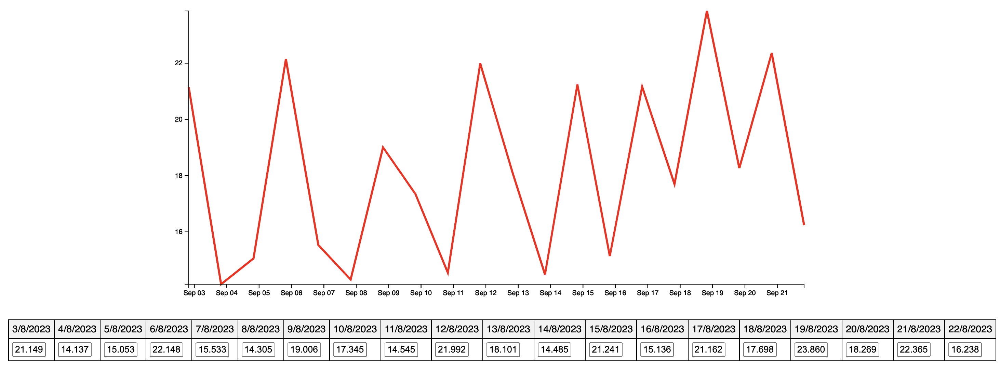

## Data Visualization Application

The Real-Time Data Visualization Application is designed to provide users with a dynamic view of data trends over a specified time period. It accomplishes this by fetching and displaying a collection of 20 objects, each containing a value and a timestamp, in the form of an interactive chart.


<p align="center">
  
</p>

## Key Features

1. **Data Display:** The application fetches a set of 20 data, allowing users to observe changes in the dataset.

2. **Interactive Charts:** Users can interact with the chart by clicking on individual data value. When a data is clicked, users have the ability to modify its value, and the chart is updated to reflect these changes.

## Purpose

This application is particularly useful for scenarios where users need to monitor and analyze data trends, make on-the-fly adjustments, and visualize the impact of those changes. Whether it's for financial data analysis, sensor data monitoring, or any other time-series data exploration, this application provides a user-friendly and dynamic solution.


## Technologies Used
- Node.Js
- React.js
- Vite.js
- D3.js
- Jest
- React testing libray
- supertest
- SCSS
- Axios


## Installation and usage

Install both Front and Back application

```
npm run init
```

Start Front and Back application

```bash
npm run start
```
You can access the application by following this link: <http://localhost:5173>

Launch all tests

```bash
npm run all-tests
```

## Project Hierachy

```bash
├── Back
│   ├── api.js
│   ├── app
│   │   ├── app.test.js
│   │   └── routes.js
│   ├── front
│   │   ├── index.html
│   │   ├── index.js
│   │   └── index.scss
│   ├── index.js
│   ├── package.json
│   └── webpack.config.js
├── Front
│   ├── index.html
│   ├── jest.config.ts
│   ├── package.json
│   ├── public
│   ├── src
│   │   ├── App.tsx
│   │   ├── __ tests __
│   │   │   └── App.spec.tsx
│   │   ├── components
│   │   │   ├── Chart
│   │   │   │   ├── Chart.test.tsx
│   │   │   │   ├── index.tsx
│   │   │   │   └── style.scss
│   │   │   ├── Container
│   │   │   │   ├── Comtainer.test.tsx
│   │   │   │   ├── index.tsx
│   │   │   │   └── style.scss
│   │   │   └── Datas
│   │   │       ├── Datas.test.tsx
│   │   │       ├── components
│   │   │       │   ├── EditableCell
│   │   │       │   │   ├── EditableCell.test.tsx
│   │   │       │   │   ├── index.tsx
│   │   │       │   │   └── style.scss
│   │   │       │   └── HeaderCell
│   │   │       │       ├── HeaderCell.test.tsx
│   │   │       │       └── index.tsx
│   │   │       ├── index.tsx
│   │   │       └── style.scss
│   │   ├── index.scss
│   │   ├── main.tsx
│   │   ├── test
│   │   │   └── __ mocks __
│   │   │       └── fileMock.js
│   │   ├── types
│   │   │   └── stock.ts
│   │   ├── utils
│   │   │   └── api.ts
│   │   └── vite-env.d.ts
│   ├── tsconfig.json
│   ├── tsconfig.node.json
│   └── vite.config.ts
├── Pictures
│   └── App.png
├── README.md
├── package-lock.json
└── package.json
```

